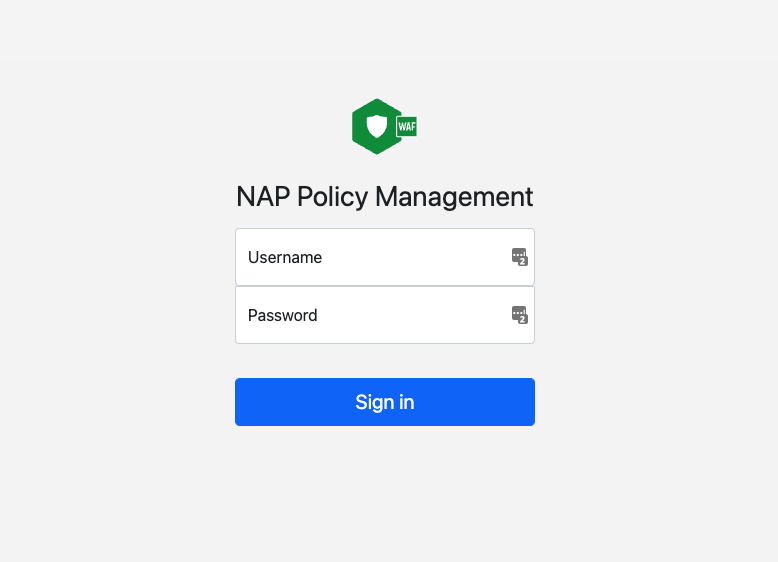

# NAP - False Positive Management
> NAP-FPM make it easier for SecOps teams to make changes to the NGINX App Protect policies.


## How does it works
NAP-FPM UI provides visibility to SecOps teams, for the different violations that exist on a SupportID and also gives the option to modify the NAP policy  with few simple clicks.


## Table of Contents

- [Installation](#installation)
- [Configuration](#configuration)
- [Support](#support)

---

## Installation
In the following section we will describe how to deploy all the required components in order for **NAP-FPM** to work successfully. 


### Pre-requisite #1 - Deploy the Datasource.
**NAP-FPM** provides doesn't provide any Datastore to save the NAP events. For storing the NAP events we rely on Elasticsearch. Please refer to the NAP-Dashboard project that provides detail steps on how to deploy Elasticsearch for NAP.


### Pre-requisite #2 - Configure GitLab.
The source of truth for the NAP policies should be GitLab. The repositories on GitLab should hold the latest version of the NAP policies that have been deployed. <br>
**NAP-FPM** must be able to pull and push the changes made on the NAP policies through the use of GitLab API. For **NAP-FPM** to have permission to do so, we need to create a GITLAB Access-Token. This can be done under `Settings`->`Access Tokens`. The token needs to have read/write access to the repository. 

<p align="left">
       
</p>


### Deploy NAP-FPM docker instance.
We provide 2 options on how to deploy the NAP-FPM as a docker container.

**First option** is to use the docker image that is already configured and pushed to DockerHub. To deploy this image simply run the following on your Docker station:
```
docker run -d -p 80:80 skenderidis/nap-fpm:latest
```

**Second option** is to use build the image based on the dockerfile that is provided on this GitHub repo.
  1. Clone the repo to your docker station and switch the working directory to be `nap-false-positive`.
  ```
  git clone https://github.com/skenderidis/nap-false-positive.git
  cd nap-false-positive
  ```

  2. Build the docker image.
  ```
  docker build -t nap-fpm:latest .
  ```

  3. Run the image that you just built.
  ```
  docker run -d -p 80:80 skenderidis/nap-fpm:latest
  ```

> Note: If you require FPM to run inside K8s please open a GitHub issue.


## Configuration
In this section we will show how to do the basic configuration of **NAP-FPM**.

Step 1. Open your browser and connect to the IP address of the running container  

<p align="left">
       
</p>
Step 2. Log in with the default credentials (admin/admin)

Step 3. The tool should redirect you to the `settings.php` page.


